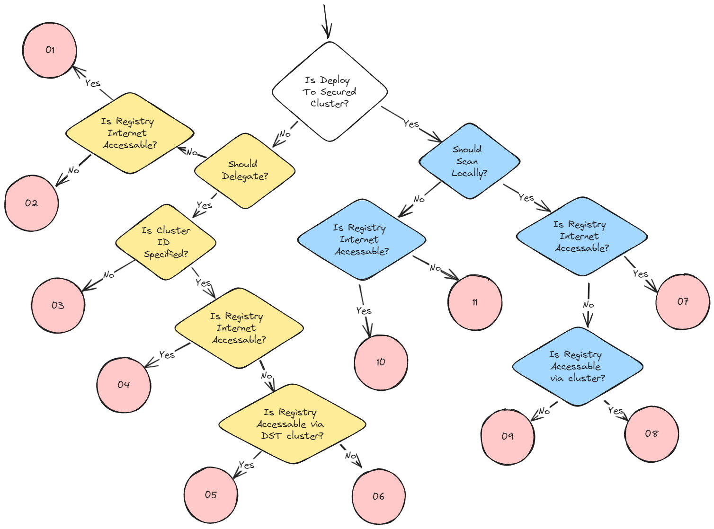

# Paths

1. Central
    1. [CENTRAL] TO Central START
        1. [CENTRAL] Scan via CLOUD
        2. [CENTRAL] Scan error - NO network path (blink registry)
        3. [CENTRAL] Scan error - NO cluster
    2. [CENTRAL] PASSTHROUGH
        1. [CENTRAL] TRANSITION to [cluster]
            - **See Sensor STARTs 1-3 (NOT 4 Passthrough)**
2. Sensor Deploy
    1. TO Sensor START
        1. [SENSOR] Index via CLOUD
            1. [SENSOR] TRANSITION Central
                1. [CENTRAL] Do Match
        2. [SENSOR] Index via LOCAL
            1. [SENSOR] TRANSITION Central
                1. [CENTRAL] Do Match
        3. [SENSOR] ERROR - NO network path (blink registry)
            1. [SENSOR] TRANSITION Central
                1. [CENTRAL] Save ERROR
        4. [SENSOR] PASSTHROUGH 
            1. [SENSOR] TRANSITION Central
                **See Central Starts 1-2 (NOT 3 cluster)**

## Segments Needed

```
A. Central ROXCTL START (central_roxctl_start)
B. Sensor DEPLOY START  (sensor_deploy_start)
C. TO Central Start
D. Central SCAN CLOUD
E. Central SCAN ERROR - NO NETWORK PATH
F. Central SCAN ERROR - NO CLUSTER
G. Central PASSTHROUGH
H. Central TRANSITION to CLUSTER [1, 2, 3, etc.] (can this be auto generated?)
I. Sensor INDEX CLOUD
J. Sensor INDEX LOCAL
K. Sensor ERROR - NO NETWORK PATH
L. Sensor PASSTHROUGH
M. Sensor TRANSITION to CENTRAL [1, 2, 3, etc.] (can this be auto generated?)
N. Central MATCH
O. Central SAVE ERROR
P. Return to ROXCTL Start
Q. TO Sensor Start
```

**Paths**
```
01. A - C - D - P
02. A - C - E - P
03. A - C - F - P
04. A - G - H - Q - I - M - C - N - P
05. A - G - H - Q - J - M - C - N - P
06. A - G - H - Q - K - M - C - O - P
07. B - Q - I - M - C - N
08. B - Q - J - M - C - N
09. B - Q - K - M - C - O
10. B - Q - L - M - C - D
11. B - Q - L - M - C - E
```

## Path Decision Tree

